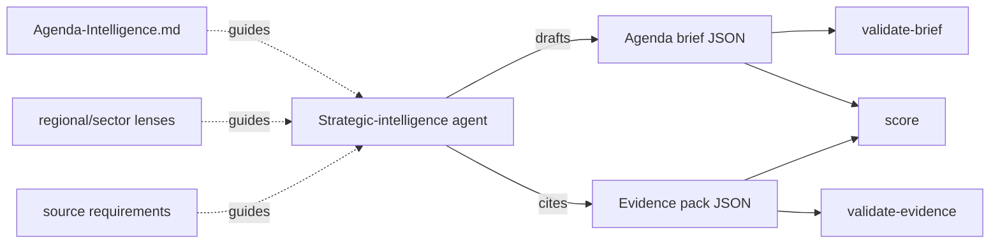

# Agenda Intelligence MD

**Evidence & eval layer for strategic intelligence agents.**

[](https://pypi.org/project/agenda-intelligence-md/)
[](LICENSE)

A protocol, JSON-schema set, CLI, and MCP-compatible toolkit that helps AI agents
move from unsupported summaries to **auditable strategic-risk briefs**:

- what changed
- why it matters
- what is evidence-backed
- what is uncertain
- who gains or loses leverage
- what scenarios are plausible
- what to watch next

It is built for engineers shipping policy, sanctions, regulation,
geopolitical-risk, market-risk, and strategic-intelligence agents — where the
output has to survive review by an analyst, not just sound plausible.

**Bundled-example baseline** (4 cases, reproduced with `python3 evals/run_benchmark.py`):

| metric | value |
|---|---|
| mean score | 86.8 / 100 |
| cases | 4 (EU AI Act, Red Sea shipping, sanctions routing, BIS AI Diffusion) |
| schema-valid | 100% |
| with evidence pack | 100% |
| with claim-level audit | 100% |
| orphan evidence refs | 0 |

---

## What this is

- **Markdown protocol** (`Agenda-Intelligence.md`) — a structured reasoning
  workflow agents can follow.
- **JSON schemas** — validate brief structure, evidence packs, memory cards,
  lens manifests.
- **CLI checks** — `validate-brief`, `validate-evidence`, `score`, `doctor`
  for CI-style validation of agent output.
- **MCP server** — a real stdio MCP server (`agenda-intelligence-mcp`)
  exposing the validation, read, and scoring tools.
- **Eval starter kit** — rubric, LLM-judge prompt, human checklist, sample
  cases, benchmark seed.
- **Source / evidence policy** — explicit rules for claim-level discipline, including per-claim provenance tags (Axis A: `[primary]` `[secondary]` `[user-provided]` `[inference]` `[analyst-judgment]`; Axis B: `[verify]` `[stale-risk: YYYY-MM]`). See [`skills/agenda-intelligence/references/evidence-discipline.md`](skills/agenda-intelligence/references/evidence-discipline.md).
- **Signal lifecycle tracker** — markdown + JSON schema for tracking signals across sessions (detected → developing → escalated → stable → resolved → archived). See [`skills/agenda-intelligence/references/signal-lifecycle.md`](skills/agenda-intelligence/references/signal-lifecycle.md) and [`schemas/signal-tracker.schema.json`](schemas/signal-tracker.schema.json).
- **Regional & sector lenses** — compact reference packs inside the protocol
  (Central Asia & Caspian, Middle East, EU; sanctions, export controls). For
  deep regional analysis, use the dedicated vertical specialist skills:
  [Central Asia + Caspian](https://github.com/vassiliylakhonin/central-asia-caspian-hybrid-intelligence-skill)
  or [Gulf + Middle East](https://github.com/vassiliylakhonin/gulf-middle-east-hybrid-intelligence-skill).

## What this is not

- **Not a factuality verifier.** It does not check whether claims are *true*.
  It checks whether they are *structurally sound, evidence-labeled, and
  decision-shaped*.
- **Not an autonomous news agent.** It does not crawl, retrieve, or rank
  sources by itself.
- **Not a source retriever.** Live retrieval is not implemented.
- **Not a replacement for analyst judgment.** Pass/fail signals tell you
  *form*, not *substance*.
- **Not a guarantee of correctness.** It surfaces missing evidence and
  uncertainty hooks; it does not guarantee them.
- **Not a mature benchmark suite yet.** The benchmark seed in
  `evals/benchmark_set.json` is a starting point, not validated results.

---

## 60-second quickstart

```bash
# From PyPI
pip install agenda-intelligence-md
# Or pinned wheel:
# pip install https://github.com/vassiliylakhonin/agenda-intelligence-md/releases/download/v0.7.3/agenda_intelligence_md-0.7.3-py3-none-any.whl

# 1. Get a source plan for a domain
agenda-intelligence start technology-ai

# 2. Validate an agent-produced brief against the schema
agenda-intelligence validate-brief examples/agenda-brief.json

# 3. Score the brief (heuristic 0-100 structural rubric)
agenda-intelligence score examples/agenda-brief.json

# 4. Score with evidence-linked feedback
agenda-intelligence score examples/agenda-brief.json --evidence examples/source/evidence-pack.json

# 5. Run the structural bench across all bundled examples
agenda-intelligence bench examples/source-backed --strict --min-score 80

# 6. Diagnose local install + MCP tool surface
agenda-intelligence doctor

# 7. Print local MCP client config
agenda-intelligence mcp-config --client cursor
```

Expected scoring output:

```text
score: 90/100
note: Heuristic structural/evidence-discipline score; does not verify factual truthfulness.
evidence_support: ... claims supported: 1/1 supported ...
```

---

## Flagship example: EU AI Act

A weak baseline summary vs. an Agenda-Intelligence-MD brief, plus the evidence
pack used to back each claim.

- Brief: [`examples/source-backed/eu-ai-act.md`](examples/source-backed/eu-ai-act.md)
- Schema-valid JSON brief: [`examples/source-backed/eu-ai-act.brief.json`](examples/source-backed/eu-ai-act.brief.json)
- Evidence pack (illustrative — placeholder URLs, not live citations):
  [`examples/source-backed/eu-ai-act.evidence.json`](examples/source-backed/eu-ai-act.evidence.json)
- Claim-level audit: [`examples/source-backed/eu-ai-act.audit.json`](examples/source-backed/eu-ai-act.audit.json)
- Before/after pair: [`examples/before-after/`](examples/before-after/)

> The evidence URLs in flagship examples are **illustrative placeholders**.
> The point is the *shape* of evidence-backed reasoning, not live citations.

Run the full pipeline on this example:

```bash
agenda-intelligence validate-brief examples/source-backed/eu-ai-act.brief.json
agenda-intelligence validate-evidence examples/source-backed/eu-ai-act.evidence.json
agenda-intelligence audit-claims examples/source-backed/eu-ai-act.audit.json --strict
agenda-intelligence score examples/source-backed/eu-ai-act.brief.json --evidence examples/source-backed/eu-ai-act.evidence.json --min-score 80
```

### Before / after (sketch)

| | Baseline LLM | Agenda-Intelligence-MD |
|---|---|---|
| Output shape | Free-text summary | Schema-valid brief |
| Claims | Implicit | Explicit, classified |
| Evidence | Mixed in / absent | Separate evidence pack |
| Uncertainty | Often missing | Required field |
| Watch-next | Often missing | Required, ≥1 indicator |
| Schema validation | N/A | `validate-brief` pass/fail |
| Evidence audit | N/A | `validate-evidence` pass/fail |
| Heuristic score | N/A | `score` 0–100 |

---

## CLI

```text
agenda-intelligence start <category>            # source plan + brief template
agenda-intelligence validate-brief <brief.json>
agenda-intelligence validate-evidence <pack.json>
agenda-intelligence audit-claims <claims.json> [--format json] [--strict]
agenda-intelligence score <brief.json> [--evidence <pack.json>] [--format json] [--min-score N]
agenda-intelligence score <before-after.md>
agenda-intelligence bench <dir>                  # validate + audit + score across a case directory
agenda-intelligence verify-quotes <pack.json>
agenda-intelligence source-plan <category>
agenda-intelligence list-lenses [--type ...]
agenda-intelligence get-lens <type> <id>
agenda-intelligence get-protocol <name>
agenda-intelligence validate-manifest
agenda-intelligence memory-search <query>
agenda-intelligence mcp-config [--client cursor|codex|claude-desktop]
agenda-intelligence doctor [--json]
agenda-intelligence --version
```

## MCP

The package ships a real stdio MCP server, `agenda-intelligence-mcp`, plus
small Python tool functions in `agenda_intelligence.mcp_server`. See
[`MCP.md`](MCP.md) and [`docs/integrations/mcp.md`](docs/integrations/mcp.md).

Implemented MCP tools (all verified by `scripts/smoke_mcp.py`):
- `validate_brief(brief_json)` — schema check
- `validate_evidence(evidence_json)` — schema check
- `audit_claims(audit_json)` — claim-level evidence audit
- `get_protocol(name)` — return packaged protocol markdown
- `list_lenses(lens_type=None)` — read from manifest
- `get_lens(lens_type, lens_id)` — return packaged lens markdown
- `source_plan(category)` — return source requirements
- `score_output(before_text, after_text)` — heuristic structure / decision-readiness score

**MCP verification status**: wire-protocol verified — `scripts/smoke_mcp.py` exercises the full JSON-RPC cycle (initialize → tools/list → tools/call) against the running stdio server. See [`MCP.md`](MCP.md).

Live source retrieval is **not implemented**.

### Example agent flow

1. Agent receives a policy/risk update.
2. Agent calls `source_plan` for the relevant category.
3. Agent drafts a brief in the protocol shape.
4. Agent calls `validate_brief` and `validate_evidence`.
5. Agent calls `score_output` for a decision-readiness signal.
6. Agent returns the brief, with explicit uncertainty and watch-next.

---

## CI / checking concept

`validate-brief` and `validate-evidence` behave like linters: zero exit on
success, non-zero on failure, errors on stderr. Drop them into any CI
pipeline that produces strategic briefs from agents:

```bash
agenda-intelligence validate-brief examples/agenda-brief.json
agenda-intelligence validate-evidence examples/source/evidence-pack.json
agenda-intelligence score examples/agenda-brief.json --evidence examples/source/evidence-pack.json --min-score 70
```

---

## Architecture



---

## Schemas

| Schema | Purpose |
|---|---|
| [`agenda-brief.schema.json`](schemas/agenda-brief.schema.json) | Brief structure |
| [`evidence-pack.schema.json`](schemas/evidence-pack.schema.json) | Evidence pack structure |
| [`signal-classification.schema.json`](schemas/signal-classification.schema.json) | Signal taxonomy |
| [`memory-card.schema.json`](schemas/memory-card.schema.json) | AnalysisBank cards |
| [`lens-manifest.schema.json`](schemas/lens-manifest.schema.json) | Lens manifest |
| [`evidence-audit.schema.json`](schemas/evidence-audit.schema.json) | Claim-level evidence audit |
| [`signal-tracker.schema.json`](schemas/signal-tracker.schema.json) | Signal lifecycle tracker |

### Evidence audit

Each important claim should be traceable:

```json
{
  "claim_id": "c1",
  "claim": "EU AI Act tightens obligations on high-risk systems.",
  "claim_type": "regulatory_change",
  "evidence_ids": ["e1", "e2"],
  "support_level": "direct",
  "uncertainty": "Enforcement timeline per sector unclear.",
  "risk_if_wrong": "Compliance plans miss deadline."
}
```

`support_level` is one of `direct | partial | weak | unsupported`.
This schema is not wired into `validate-evidence` by default; use `audit-claims` directly.

---

## Evals

See [`docs/evaluation.md`](docs/evaluation.md) for the full layer breakdown.

Key honesty rule:

> Current scoring does not verify factual truth. It evaluates structure,
> completeness, evidence labeling, and decision-readiness signals.

Bundled-example baseline: mean 86.8/100, 4 cases, 100% schema-valid, 0 orphan refs.
Reproduce with `python evals/run_benchmark.py`. Human-judge benchmarking is not done yet.

---

## Status

| Component | Status |
|---|---|
| Markdown protocol | Stable |
| JSON schemas (brief, evidence, lens, memory, signal) | Stable |
| CLI: validate-*, score, start, source-plan, doctor, mcp-config | Stable |
| Lenses (Central Asia, Middle East, EU; sanctions, export controls) | Stable |
| MCP stdio server (`agenda-intelligence-mcp`) | Stable |
| MCP tool functions (validate / read / score / audit_claims) | Stable |
| Evidence-audit schema (claim-level) | Stable |
| Signal-tracker schema (lifecycle) | Stable |
| Live source retrieval | Not implemented |
| Heuristic benchmark baseline (4 bundled cases) | Produced — mean 86.8/100 |
| Human-judge benchmark results | Not produced yet |
| Factual-truth verification | Not in scope today |

## Limitations

- No factual verification. The toolkit checks form, not truth.
- No live source retrieval. Evidence packs are user- or agent-supplied.
- Scoring is heuristic. The rubric is documented; an LLM-judge prompt is
  provided; results are not benchmarked yet.
- Lens coverage is intentionally narrow.

## Contributing eval cases

The most valuable contribution is a *case*: a real public event with a
baseline agent output, a target brief, and a human checklist. See
[`CONTRIBUTING.md`](CONTRIBUTING.md) and [`evals/cases/`](evals/cases/).

---

## Repository layout

```
agenda-intelligence-md/
├─ src/agenda_intelligence/   # Python package (CLI + MCP server + tools)
├─ schemas/                   # JSON schemas
├─ examples/                  # briefs, evidence packs, before/after
├─ analysis-bank/             # reusable reasoning patterns (memory cards)
├─ evals/                     # rubric, judge prompt, checklist, cases
├─ docs/                      # guides, integrations, use-cases
├─ skills/agenda-intelligence/# OpenClaw skill wrapper
├─ skills/source-ingest/      # Source normalization skill (PDF/DOCX/URL → structured source record)
└─ tests/                     # pytest suite
```

## Documentation

| Resource | Link |
|---|---|
| Quickstart | [`docs/quickstart.md`](docs/quickstart.md) |
| End-to-end tutorial | [`docs/tutorial.md`](docs/tutorial.md) |
| Evaluation | [`docs/evaluation.md`](docs/evaluation.md) |
| Evidence audit | [`docs/evidence-audit.md`](docs/evidence-audit.md) |
| Agent integration sketch | [`docs/integrations/agent-loop.md`](docs/integrations/agent-loop.md) |
| Use-cases | [`docs/use-cases/`](docs/use-cases/) |
| Integrations | [`docs/integrations/`](docs/integrations/) |
| Roadmap | [`ROADMAP.md`](ROADMAP.md) |
| Changelog | [`CHANGELOG.md`](CHANGELOG.md) |

## License

MIT.
