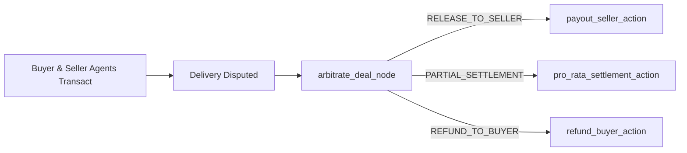

# LangGraph Dispute Arbitration Node with M2MEscrowArbiter

This example demonstrates how to integrate `M2MEscrowArbiter` as a deterministic arbitration node in LangGraph multi-agent workflows.

## Workflow Pattern



## Running the Example

```bash
python3 run.py
```
